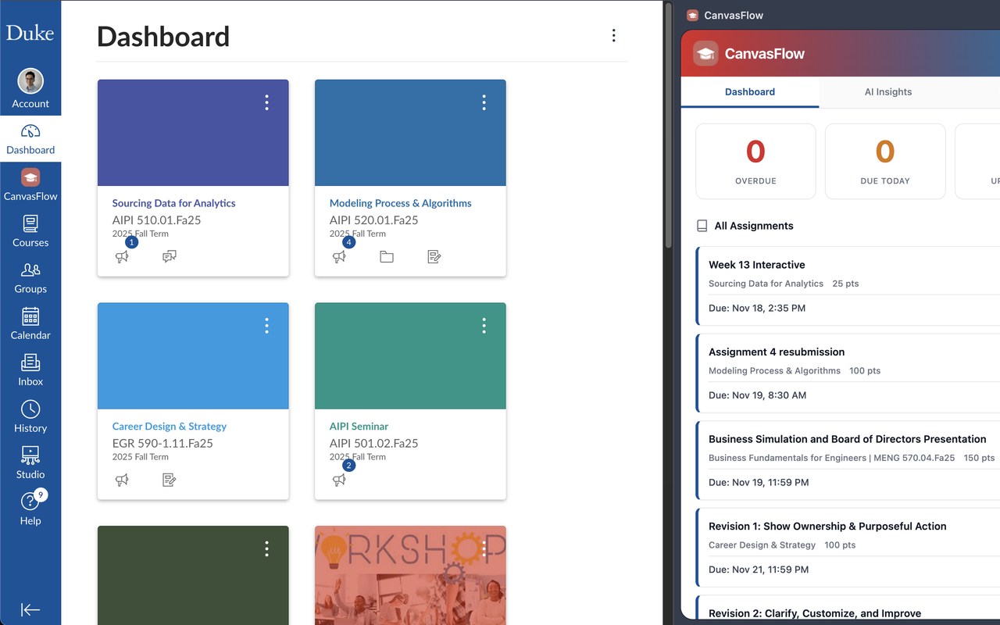

# CanvasFlow

[](https://github.com/jonasneves/canvasflow/releases/tag/nightly)
[](https://opensource.org/licenses/MIT)
[](https://github.com/jonasneves/canvasflow/issues)
[](https://github.com/jonasneves/canvasflow/stargazers)

CanvasFlow is a Chrome extension that enhances your Canvas LMS experience with AI-powered insights and intelligent schedule planning.

## Features

- **Direct Canvas Integration**: View assignments instantly - no Canvas API key or authentication required
- **AI-Powered Insights**: Claude AI with Extended Thinking analyzes your workload and provides strategic recommendations
- **Structured Outputs**: Consistent, reliable AI responses using Claude's latest structured output capabilities
- **Weekly Schedule Generation**: AI-generated 7-day study plans optimized for your deadlines and workload
- **Browser-Based MCP Server**: Industry-first embedded MCP server lets you talk to your Canvas data through Claude Desktop - no separate server installation needed
- **Smart Filtering**: Filter assignments by time range, course, and completion status

## Screenshots

### Dashboard View


*Track assignments across all courses with smart filtering and status cards*

### AI-Powered Insights


*Get strategic recommendations powered by Claude AI with Extended Thinking*

### Weekly Schedule


*AI-generated time-blocked study plans optimized for your deadlines*

### Seamless Canvas Integration


*Side panel works alongside Canvas for instant access to insights*

### Claude Desktop Integration


*Query your Canvas data directly through Claude Desktop conversations*

## Project Structure

```
canvasflow/
├── extension/          Chrome extension files
├── native-host/        Native messaging host (optional MCP integration)
└── README.md           This file
```

## Installation

### Chrome Extension

1. Download or clone this repository
2. Open Chrome and navigate to `chrome://extensions/`
3. Enable "Developer mode" in the top-right corner
4. Click "Load unpacked" and select the `extension/` directory
5. The CanvasFlow icon will appear in your extensions toolbar

### Configuration

1. Click the CanvasFlow icon while on any Canvas LMS page
2. Open Settings (gear icon in the sidepanel)
3. Enter your Claude API key (required for AI features)
4. Adjust assignment time range and auto-refresh settings as needed

### Claude API Key

To use AI-powered insights and schedule generation, you need an Anthropic Claude API key:

1. Visit https://console.anthropic.com/
2. Create an account or sign in
3. Generate an API key from the dashboard
4. Enter the key in CanvasFlow Settings

## Usage

### Dashboard View

Click the CanvasFlow icon to open the sidepanel while browsing Canvas:

- **Assignment Overview**: Direct data extraction from Canvas (no API required)
- **Smart Filters**: Filter by time range, course, or completion status
- **One-Click Refresh**: Instantly sync with the current Canvas page

### AI Insights Tab

Generate intelligent analysis powered by Claude AI:

- **Extended Thinking**: Claude uses separate reasoning budget for deeper analysis
- **Structured Outputs**: Guaranteed consistent JSON responses with priority rankings
- **Actionable Recommendations**: Strategic advice for tackling your workload
- **Priority Detection**: Automatic urgency scoring based on deadlines and workload

### Weekly Schedule

AI-generated 7-day study plan:

- **Time-Blocked Schedule**: Optimized daily task distribution
- **Strategic Recommendations**: Week-level planning and focus areas
- **Workload Balancing**: Even distribution based on assignment complexity

### MCP Integration (Optional)

Connect Claude Desktop to your Canvas data:

- **Browser-Based Server**: No separate server installation required
- **Real-Time Data**: Claude Desktop can query your Canvas assignments
- **Native Messaging**: Secure local communication between extension and Claude Desktop

## Privacy

CanvasFlow processes your Canvas data locally in your browser and only sends assignment information to Claude AI when you explicitly request AI insights or schedule generation. Your Claude API key is stored locally in Chrome's secure storage.

- No data is collected or sent to external servers (except Claude AI when requested)
- Canvas data remains in your browser's local storage
- API key is stored securely using Chrome's storage API

## Contributing

Contributions are welcome! Please feel free to submit issues or pull requests.

## Built With

This project was built with assistance from [Claude Code](https://claude.ai/code) - an AI-powered development environment that helped with architecture design, implementation, testing, and documentation.

## License

MIT License - See LICENSE file for details

## Support

For issues, questions, or feature requests, please visit the GitHub repository.
